# Prerequisites

```mermaid
flowchart TD
    A[Your DSPy Journey] --> B{Check Requirements}

    B --> C[✅ Knowledge]
    B --> D[⚙️ Technical]
    B --> E[🔑 API Access]

    C --> F[Python Skills]
    C --> G[Command Line]
    C --> H[LLM Basics]

    D --> I[OS Compatibility]
    D --> J[Python 3.9+]
    D --> K[Editor/IDE]

    E --> L[OpenAI/Claude/Local]

    F --> M[🎯 Ready to Learn]
    G --> M
    H --> M
    I --> M
    J --> M
    K --> M
    L --> M

    style A fill:#e3f2fd
    style M fill:#e8f5e8
```

<div align="center">



</div>

---

## Setting the Foundation

Before diving into DSPy's powerful capabilities, let's ensure you have the solid foundation needed for a successful learning journey. Think of this as your pre-flight checklist—we want to make sure you're equipped for takeoff!

<div align="center">

### Your Learning Readiness Meter

```mermaid
graph LR
    A[📚 Knowledge] --> B[⚙️ Tools]
    A --> C[🔑 Access]

    B --> D[🎯 Success]
    C --> D

    style A fill:#fff3e0
    style B fill:#e8f5e8
    style C fill:#e3f2fd
    style D fill:#f3e5f5
```



</div>

---

## Essential Knowledge Areas

### 🐍 1. Python Programming (Foundation Required)

<div align="center">

**Python Proficiency Breakdown:**
- Basic Syntax: 30%
- Object-Oriented Programming: 25%
- Modules & Packages: 20%
- Error Handling: 15%
- Data Structures: 10%

</div>

**What You Should Master:**

<div align="center">

| Skill Level | ✅ Must Have | 💡 Helpful to Know |
|-------------|-------------|-------------------|
| **Beginner** | Variables, loops, conditionals | List comprehensions |
| **Core** | Functions, classes, inheritance | Decorators, generators |
| **Practical** | Import/using modules | Package creation |
| **Robust** | Try/except blocks | Context managers |

</div>

**Experience Level**: 6+ months of practical Python programming

**Self-Assessment Test**:

Can you read, understand, and modify this code?

```python
class DataProcessor:
    """Process data with error handling and transformation."""

    def __init__(self, data: list[str]):
        self.data = data
        self.processed_count = 0

    def process(self) -> list[str]:
        """Transform all data items, handling errors gracefully."""
        results = []

        for item in self.data:
            try:
                transformed = self._transform(item)
                results.append(transformed)
                self.processed_count += 1
            except ValueError as e:
                print(f"⚠️ Skipping '{item}': {e}")

        print(f"✅ Successfully processed {self.processed_count}/{len(self.data)} items")
        return results

    def _transform(self, item: str) -> str:
        """Transform individual item - can be customized."""
        if not item.strip():
            raise ValueError("Empty string not allowed")

        return item.strip().upper()

# Usage example
processor = DataProcessor(["hello", "world", "", "DSPy"])
results = processor.process()
print(f"Results: {results}")
```

**If this feels comfortable, you're ready!**

**Need to Level Up Your Python?**

| Resource | Type | Best For |
|----------|------|----------|
| **[Python.org Tutorial](https://docs.python.org/3/tutorial/)** | Official Guide | Comprehensive learning |
| **[Real Python](https://realpython.com/)** | Practical Tutorials | Hands-on skills |
| **[Automate the Boring Stuff](https://automatetheboringstuff.com/)** | Project-Based | Practical applications |

### 🖥️ 2. Command Line Essentials (Daily Use)

<div align="center">


</div>

**Essential Commands to Master:**

<div align="center">

| Task | Command | What It Does |
|------|---------|--------------|
| **Navigate** | `cd path/` | Change directory |
| **List contents** | `ls` (macOS/Linux) or `dir` (Windows) | See files/folders |
| **Current location** | `pwd` (macOS/Linux) or `cd` (Windows) | Show current path |
| **Run Python** | `python script.py` | Execute Python file |
| **Install packages** | `pip install package` | Add Python packages |

</div>

**Quick Test**:

Can you execute these commands confidently?

```bash
# Navigate to your projects folder
cd ~/projects

# Create a new folder
mkdir dspy-learning

# Enter the folder
cd dspy-learning

# Create a Python file
echo "print('Hello DSPy!')" > test.py

# Run the file
python test.py
```

**Need Command Line Practice?**
- **[Command Line Crash Course](https://learnpythonthehardway.org/python3/appendixa.html)** - Quick and practical
- **[The Linux Command Line](https://linuxcommand.org/tlcl.php)** - Comprehensive guide (works on macOS/WSL too)

### 🤖 3. LLM Fundamentals (Conceptual Understanding)

<div align="center">


</div>

**Good News**: You don't need to be an LLM expert! Chapter 1 covers everything you need.

**But having these concepts helps:**
- ✅ Know what ChatGPT/Claude are
- ✅ Understand you can "ask" AI questions
- ✅ Basic awareness that AI can be accessed via code

**If you're completely new to LLMs:**
| Resource | Focus | Time Investment |
|----------|-------|-----------------|
| **[OpenAI API Docs](https://platform.openai.com/docs/guides/gpt)** | API concepts | 30 minutes |
| **[Prompt Engineering Guide](https://www.promptingguide.ai/)** | Prompting basics | 1 hour |
| **Or just wait for Chapter 1!** | DSPy-specific | Built into book |

---

## Bonus Knowledge Areas (Not Required, But Helpful)

<div align="center">

### Nice-to-Have Skills

**Helpful Bonus Skills:**
- Machine Learning: Metrics, Train/Test Splits, Optimization
- Natural Language Processing: Text Processing, Embeddings, Tokenization
- Software Engineering: Version Control (Git), Testing, APIs

*These are completely optional - the book introduces concepts as needed!*

</div>


---

## Technical Setup Requirements

### 💻 1. Operating System Compatibility

```mermaid
graph TD
    A[Your OS] --> B{Which System?}

    B --> C[🍎 macOS]
    B --> D[🐧 Linux]
    B --> E[🪟 Windows]

    C --> F[✅ Native Support]
    D --> F
    E --> G[WSL2 Recommended]

    F --> H[Ready to Go!]
    G --> H

    style A fill:#e3f2fd
    style H fill:#e8f5e8
```

<div align="center">



</div>

**Fully Supported Platforms:**

| Platform | Version | Notes |
|----------|---------|-------|
| **macOS** | 10.14+ | Native support, excellent |
| **Linux** | Ubuntu 20.04+ | Native support, ideal |
| **Windows** | 10/11 | WSL2 recommended, native works |

> **💡 Windows Tip**: WSL2 (Windows Subsystem for Linux) provides a Linux environment within Windows. Highly recommended for the smoothest development experience.

### 🐍 2. Python Version Check

<div align="center">

**Python Version Requirements**

```mermaid
graph TD
    A[Check Python] --> B{Version >= 3.9?}

    B -->|✅ Yes| C[Perfect!]
    B -->|❌ No| D[Upgrade Python]

    C --> E[Continue Setup]
    D --> E

    style A fill:#e3f2fd
    style C fill:#e8f5e8
    style D fill:#ffebee
```



</div>

**Check Your Python Version:**

```bash
# Try these commands
python3 --version
# or
python --version
```

**Expected Output:**
```
Python 3.9.0  # or any version 3.9.x, 3.10.x, 3.11.x, or higher
```

**Need to Upgrade Python?**

| Option | Best For | Link |
|--------|----------|------|
| **Python.org** | Standard installation | [python.org/downloads](https://www.python.org/downloads/) |
| **Anaconda** | Data science focused | [anaconda.com/products/distribution](https://www.anaconda.com/products/distribution) |
| **Pyenv** | Multiple versions | [github.com/pyenv/pyenv](https://github.com/pyenv/pyenv) |

### 📦 3. Package Manager (pip)

<div align="center">


</div>

**Verify pip is available:**

```bash
pip3 --version
# or
pip --version
```

**Should see something like:**
```
pip 23.2.1 from /usr/local/lib/python3.11/site-packages/pip (python 3.11)
```

### ✏️ 4. Code Editor or IDE

<div align="center">

**Choose Your Weapon**

```mermaid
graph TD
    A[Choose Editor] --> B{Your Level?}

    B --> C[🌱 Beginner]
    B --> D[🚀 Advanced]

    C --> E[VS Code]
    C --> F[PyCharm Community]

    D --> G[Vim/Neovim]
    D --> H[Emacs]
    D --> I[Sublime Text]

    E --> J[Perfect Start]
    F --> J
    G --> J
    H --> J
    I --> J

    style A fill:#e3f2fd
    style J fill:#e8f5e8
```



</div>

**Recommended Options:**

| Category | Options | Why Choose It |
|----------|---------|---------------|
| **Beginner Friendly** | **VS Code** (free) | Excellent Python support, great debugger |
| **Python-Focused** | **PyCharm Community** (free) | Designed for Python development |
| **Cloud Options** | **Google Colab**, **Replit** | No installation required |
| **Professional** | Vim, Emacs, Sublime | Lightweight, customizable |

### 🏗️ 5. Virtual Environments (Highly Recommended)

```mermaid
graph LR
    A[Virtual Environment] --> B[Isolate Projects]
    A --> C[Avoid Conflicts]
    A --> D[Clean Setup]

    B --> E[✅ Dependency Management]
    C --> F[✅ No Version Conflicts]
    D --> G[✅ Easy Cleanup]

    style A fill:#e3f2fd
    style E fill:#e8f5e8
    style F fill:#e8f5e8
    style G fill:#e8f5e8
```

<div align="center">



</div>

**Popular Options:**

| Tool | Best For | We'll Cover |
|------|----------|-------------|
| **venv** | Most users | ✅ Built into setup chapter |
| **conda** | Data scientists | Mentioned in setup |
| **poetry** | Advanced users | Brief mention |

---

## LLM Access & API Keys

<div align="center">


</div>

### Option 1: OpenAI API (Recommended for Beginners)

<div align="center">

| Feature | Details |
|---------|---------|
| **Cost** | ~$0.002 per 1K tokens (GPT-4o-mini) |
| **Free Credit** | $5 for new accounts |
| **Models Available** | GPT-4o, GPT-4o-mini, GPT-3.5-turbo |
| **Best For** | Learning, experimentation |
| **Sign Up** | [platform.openai.com](https://platform.openai.com/) |

</div>

### Option 2: Anthropic Claude (Production-Ready)

<div align="center">

| Feature | Details |
|---------|---------|
| **Cost** | Competitive with OpenAI |
| **Free Credit** | Varies by promotion |
| **Models Available** | Claude-3.5-Sonnet, Claude-3-Haiku |
| **Best For** | Production applications |
| **Sign Up** | [console.anthropic.com](https://console.anthropic.com/) |

</div>

### Option 3: Local Models (Privacy-Focused)

<div align="center">

| Feature | Details |
|---------|---------|
| **Cost** | Free (uses your computer) |
| **Hardware** | CPU works, GPU recommended |
| **Recommended Model** | qwen2.5:0.5b (only 0.5GB!) |
| **Tools** | Ollama, LM Studio, LocalAI |
| **Best For** | Privacy, offline work, learning without costs |

</div>

### Budget Expectations

<div align="center">


</div>

---

## Hardware Requirements

<div align="center">

### Minimum vs Recommended


</div>

**Important Note**: DSPy itself is lightweight! Your computer just sends API requests. Heavy hardware is only needed if you want to run large models locally.

---

## Time Investment Planning

<div align="center">

### Your Learning Timeline

**Choose a path that fits your schedule:**

| Learning Path | Total Hours | Weekly Pace | Duration |
|---------------|-------------|-------------|----------|
| **Complete Beginner** | 40-60 hours | 5-10 hours | 6-8 weeks |
| **Intermediate** | 20-30 hours | 5-10 hours | 3-4 weeks |
| **Advanced/Reference** | 5-20 hours | As needed | Variable |

</div>

### Commitment Guidelines

- **Beginners**: Plan 6-8 weeks for comprehensive learning
- **Intermediates**: 3-4 weeks for focused skill building
- **Advanced**: Learn at your own pace as needed

---

## Pre-Flight Checklist ✈️

<div align="center">

### Before Proceeding to Setup

```mermaid
graph TD
    A[Setup Checklist] --> B[Python Ready?]
    A --> C[Editor Chosen?]
    A --> D[API Access?]
    A --> E[Time Planned?]

    B --> F[✅ Python 3.9+ Installed]
    C --> G[✅ Code Editor Ready]
    D --> H[✅ API Key Obtained]
    E --> I[✅ Schedule Allocated]

    F --> J[🚀 Ready for Setup!]
    G --> J
    H --> J
    I --> J

    style A fill:#e3f2fd
    style J fill:#e8f5e8
```



</div>

**Check Each Box Before Moving On:**

- [ ] **Python 3.9+** installed and working
- [ ] **pip** package manager available
- [ ] **Code editor** chosen and installed
- [ ] **Basic Python skills** (can write classes and functions)
- [ ] **Command line basics** (can navigate and run scripts)
- [ ] **API access** to at least one LLM provider
- [ ] **Time allocated** for setup (1-2 hours)
- [ ] **Space available** for learning (both mental and disk!)

---

## Common Concerns & Solutions

<div align="center">

### Frequently Asked Questions


</div>

### "I'm not sure if my Python is strong enough..."

**Quick Test**: If you can write this without looking up every concept:

```python
def process_data(items: list[str]) -> dict[str, int]:
    """Count occurrences of each item."""
    counts = {}
    for item in items:
        counts[item] = counts.get(item, 0) + 1
    return counts

class DataAnalyzer:
    def __init__(self, data: list[str]):
        self.data = data
        self.processed = False

    def analyze(self) -> dict[str, int]:
        if not self.processed:
            self.results = process_data(self.data)
            self.processed = True
        return self.results
```

**You're ready!** DSPy-specific concepts will be thoroughly explained.

### "I've never used APIs before..."

**Perfect!** We'll guide you through:
1. Getting your first API key
2. Making your first API call
3. Understanding API responses
4. Error handling best practices

### "I'm worried about costs..."

**Cost-Saving Strategies:**
- Use GPT-4o-mini for learning (cheapest)
- Run experiments locally first
- Cache responses when iterating
- Use the $5 free credit effectively

---

## Ready for the Next Step?

<div align="center">

### Your Learning Journey Awaits!

```mermaid
graph TD
    A[🎉 Prerequisites Met!] --> B[Next: Setup Instructions]

    B --> C[Install DSPy]
    B --> D[Configure API Keys]
    B --> E[Run First Example]
    B --> F[Start Learning!]

    C --> G[🚀 Your DSPy Adventure]
    D --> G
    E --> G
    F --> G

    style A fill:#e8f5e8
    style G fill:#f3e5f5
```



</div>

**You're equipped and ready!** The next chapter will guide you through:
1. Setting up your development environment
2. Installing DSPy and dependencies
3. Configuring API access
4. Running your first DSPy program

---

<div align="center">

### 🌟 Remember: Every Expert Was Once a Beginner

**You don't need to be perfect**—you just need to start.

**DSPy is designed to make LLM development accessible**, and this book is designed to make DSPy accessible to you.

**Let's build something amazing together!** 🚀

---

*If you're unsure about any prerequisite, don't worry—the next chapter includes troubleshooting and setup assistance for every scenario.*

</div>