# Preface

<div align="center">
<h1>Welcome to <em>DSPy: A Practical Guide</em></h1>
<p><strong>A comprehensive journey from prompt engineering to prompt programming</strong></p>
</div>

---

## The Challenge of Traditional Prompt Engineering

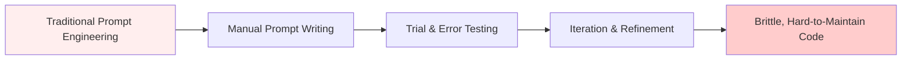

Large Language Models (LLMs) have revolutionized AI application development, but we've hit a wall. The traditional approach of manual prompt engineering—painstakingly crafting the perfect prompt—faces fundamental limitations:

<div align="center">

| Limitation | Impact | Cost |
|------------|--------|------|
| **Brittleness** | Small changes break behavior | 🔴 High |
| **Scalability** | Doesn't work for complex pipelines | 🔴 High |
| **Maintainability** | Hard to update and debug | 🔴 High |
| **Reproducibility** | Inconsistent results across runs | 🔴 High |
| **Optimization** | Manual tuning is time-consuming | 🔴 High |

</div>

## The DSPy Paradigm Shift

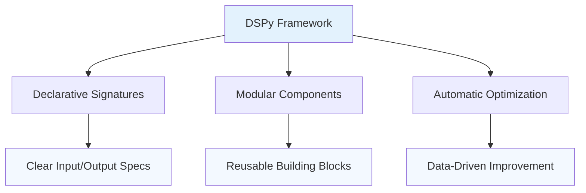

**DSPy changes everything.** Instead of manually tuning prompts, DSPy introduces a programming paradigm for LM-based applications. Think of it as the difference between:

<div align="center">

```python
# Traditional approach
prompt = "Summarize this text: {text}"
response = llm(prompt)

# DSPy approach
class Summarize(dspy.Signature):
    """Summarize a given text."""
    text = dspy.InputField()
    summary = dspy.OutputField()

summarizer = dspy.ChainOfThought(Summarize)
```

</div>

This isn't just a convenience—it's a fundamental shift from **prompt engineering** to **prompt programming**.

---

## The Learning Journey

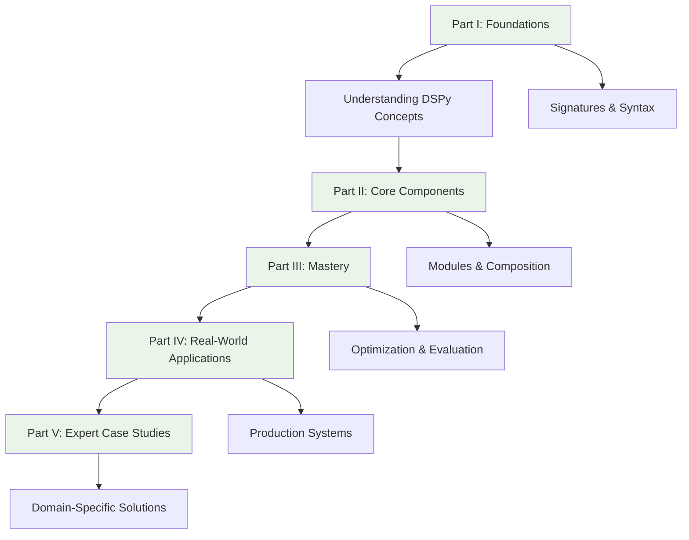

### Progressive Learning Paths

This book accommodates every skill level with tailored learning paths:

<div align="center">

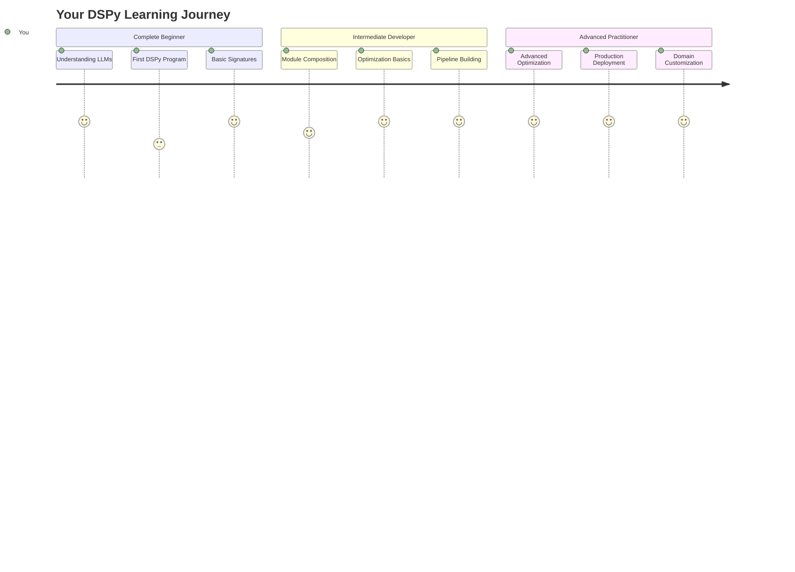

</div>

---

## Who This Book Is For

<div align="center">

### 🌱 **Complete Beginners**
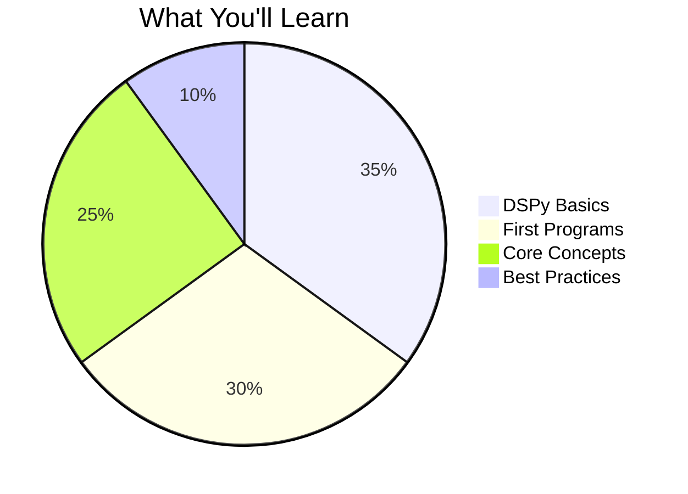

- New to DSPy and want to learn from scratch?
- Understand Python basics but haven't worked extensively with LLMs?
- Want a step-by-step guide with clear explanations and examples?

### 🚀 **Intermediate Developers**
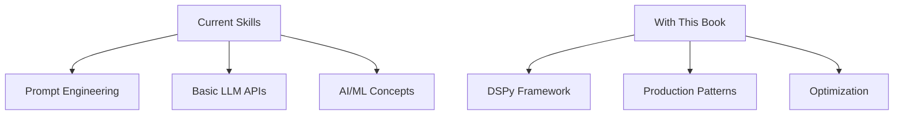

- Worked with LLMs and prompt engineering before?
- Understand the basics of AI/ML concepts?
- Want to learn DSPy's framework to build more robust applications?

### 🏆 **Advanced Practitioners**
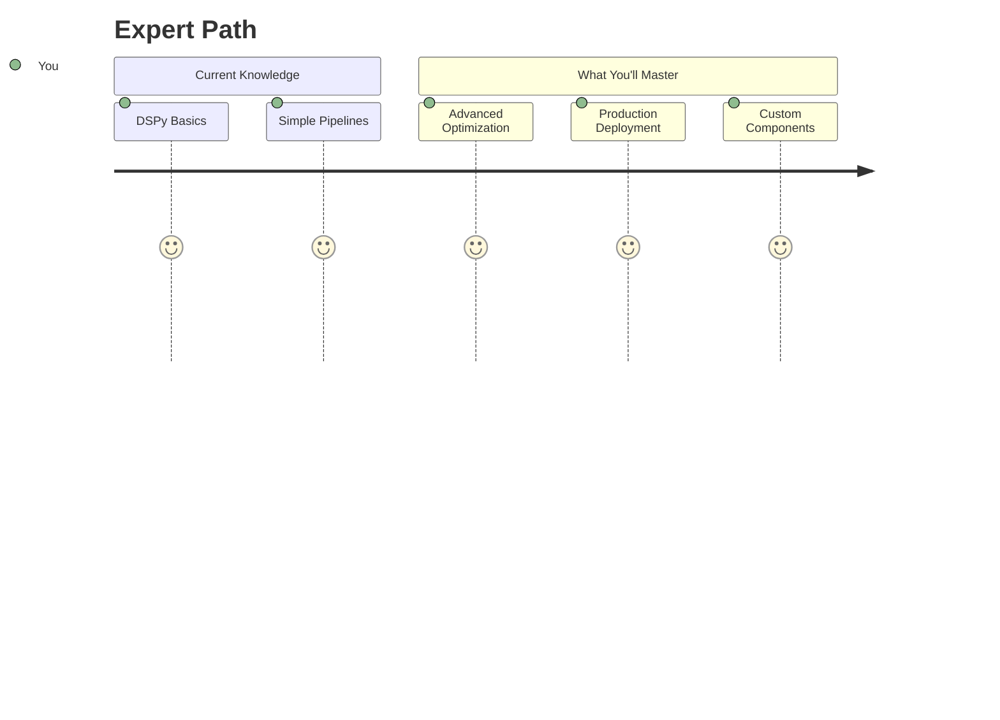

- Already familiar with DSPy's basic concepts?
- Want to learn optimization techniques and production patterns?
- Looking for real-world case studies and advanced applications?

</div>

**Regardless of your level**, this book provides multiple reading paths so you can start at the right place and progress at your own pace.

---

## What Makes This Book Unique

<div align="center">

### 🎯 **Practical Focus**
- **50+ runnable code examples** you can modify and experiment with
- **Real-world case studies** from healthcare to finance
- **Production-ready patterns** you can use immediately

### 📚 **Complete Coverage**
- **9 research papers** explained with practical implementations
- **All DSPy optimizers** from BootstrapFewShot to MIPRO
- **End-to-end workflows** from concept to deployment

### 🛠️ **Hands-On Learning**
- **40+ exercises** with detailed solutions
- **Progressive complexity** ensuring solid foundations
- **Challenge problems** for advanced learners

</div>

### The DSPy Advantage

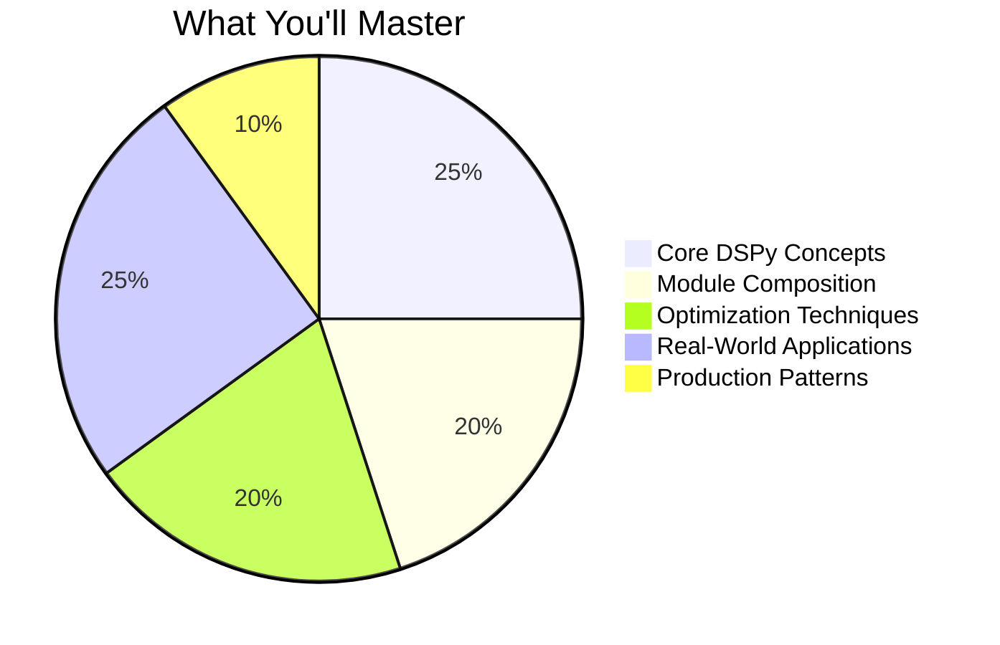

---

## The Real-World Impact

### Industry Applications

<div align="center">

| Domain | Challenge | DSPy Solution | Business Impact |
|--------|----------|---------------|----------------|
| **Healthcare** | Clinical Note Analysis | Structured Extraction | ⬆️ 50% Faster Processing |
| **Finance** | Risk Assessment | Multi-Stage Evaluation | ⬆️ 40% Better Accuracy |
| **Legal** | Contract Review | Automated Clause Extraction | ⬇️ 80% Time Reduction |
| **Research** | Literature Review | Knowledge Synthesis | ⬆️ 3x Coverage |
| **Support** | Customer Service | Contextual Responses | ⬆️ 60% Satisfaction |

</div>

### Performance Gains

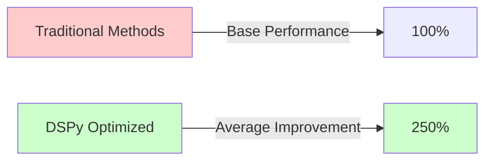

---

## What You'll Master

<div align="center">

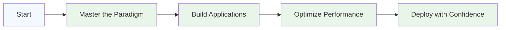

### 🎯 Core Competencies

| Skill | Module | Mastery Level |
|-------|---------|---------------|
| **DSPy Paradigm** | Part I | Foundation → Expert |
| **Signatures & Modules** | Part II | Basic → Advanced |
| **Optimization** | Part III | Manual → Automatic |
| **Production Systems** | Part IV | Concept → Reality |
| **Domain Solutions** | Part V | Theory → Practice |

### 📚 Learning Outcomes

After completing this book, you'll:
- ✅ **Build production-ready LM applications**
- ✅ **Optimize for performance and accuracy**
- ✅ **Deploy at scale with confidence**
- ✅ **Create custom DSPy components**
- ✅ **Apply DSPy across domains**

</div>

---

## Your Learning Toolkit

<div align="center">

### 📦 **What You Get**
- ✅ **Complete Code Repository** with all examples
- ✅ **Docker Environment** for consistency
- ✅ **Jupyter Notebooks** for experimentation
- ✅ **Solution Keys** for all exercises
- ✅ **Bonus Materials** and resources

</div>

---

## The Philosophy Behind This Book

### Learning by Doing

<div align="center">

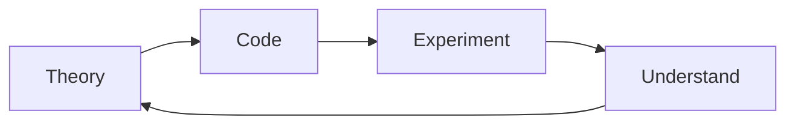

</div>

We believe the best way to learn DSPy is by writing code, making mistakes, and understanding why things work the way they do. Every concept in this book is immediately followed by practical implementation.

### From Concepts to Production

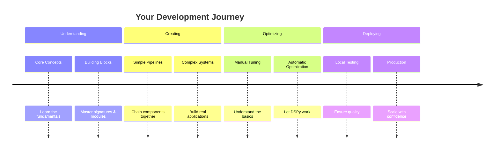

---

## A Note on the Code

All examples in this book are designed for:
<div align="center">

- **Python 3.9+** 🐍
- **DSPy 2.5+** 📚
- **Modern Best Practices** ✨

```python
# Type hints for clarity
def process_text(text: str) -> str:
    """Process text using DSPy."""
    # Your implementation here
    pass
```

</div>

---

## Acknowledgments

This book stands on the shoulders of giants. Special thanks to:
- **The DSPy Team** at Stanford NLP for creating this revolutionary framework
- **Omar Khattab** and contributors for their dedication and vision
- **The Community** for feedback, examples, and enthusiasm
- **Early Readers** for their valuable insights and suggestions

---

## Your Learning Journey Awaits

<div align="center">

### 🌟 The future of AI development is **programmatic**
### 🚀 DSPy is the framework that makes it possible
### 📖 This book is your comprehensive guide

<h2>Ready to transform how you build with LLMs?</h2>

**Turn the page to begin your journey.**

</div>

---

<div align="center">

*Dustin Ober*<br>
*December 2025*

</div>