# How to Use This Book

```mermaid
flowchart TD
    A[Your Learning Journey] --> B{Choose Your Path}

    B --> C[🌱 Complete Beginner]
    B --> D[🚀 Intermediate Developer]
    B --> E[🎯 Advanced Practitioner]

    C --> F[Sequential Learning<br>40-60 hours]
    D --> G[Focused Learning<br>20-30 hours]
    E --> H[Topic-Driven<br>5-20 hours]

    F --> I[Master Fundamentals]
    G --> J[Build Applications]
    H --> K[Solve Problems]

    I --> L[DSPy Proficiency]
    J --> L
    K --> L

    style A fill:#e3f2fd
    style L fill:#e8f5e8
```

<div align="center">



</div>

---

## Welcome to Your DSPy Learning Adventure

This book is crafted to be your comprehensive companion in mastering DSPy, whether you're taking your first steps in LLM programming or looking to level up your existing skills. Think of this book not just as a manual, but as your personal guide through the exciting landscape of programmatic LM development.

<div align="center">

### The Philosophy Behind This Book


</div>

---

## The Book's Architecture

<div align="center">


</div>

### The Complete Learning Journey

<div align="center">

| Part | Focus | Chapters | Difficulty | Time Commitment |
|------|--------|-----------|------------|-----------------|
| **I: Foundations** | Core Concepts & Setup | 1 | ⭐ Beginner | 4-6 hours |
| **II: Core Concepts** | Building Blocks | 2-3 | ⭐⭐ Intermediate | 8-12 hours |
| **III: Optimization** | Performance & Tuning | 4-5 | ⭐⭐⭐ Advanced | 10-14 hours |
| **IV: Applications** | Real-World Use | 6-7 | ⭐⭐⭐ Advanced | 12-16 hours |
| **V: Case Studies** | Domain Expertise | 8 | ⭐⭐⭐⭐ Expert | 8-12 hours |
| **Appendices** | Reference Materials | 9 | All Levels | As needed |

</div>

---

## Three Paths to Mastery

<div align="center">

**Your Learning Journey by Level:**

- **Complete Beginner**: Understanding basics → First program → Core concepts → Building projects
- **Intermediate Developer**: Quick review → Deep dive concepts → Optimization → Real applications
- **Advanced Expert**: Problem solving → Advanced patterns → Production systems

</div>

### 🌱 Path 1: The Complete Beginner

**Perfect for you if:**
- New to the world of LLM programming
- Want a comprehensive foundation
- Prefer structured, step-by-step learning

<div align="center">


</div>

**Your Roadmap:**
1. **Foundation First** - Master the basics thoroughly
2. **Practice Consistently** - Every exercise, every example
3. **Build Incrementally** - From simple to complex
4. **Apply Widely** - Use concepts in varied contexts

**Success Indicators:**
- ✅ All exercises completed with understanding
- ✅ Built confidence in core DSPy concepts
- ✅ Successfully deployed projects

### 🚀 Path 2: The Intermediate Developer

**Ideal for you if:**
- Comfortable with Python and ML concepts
- Familiar with basic LLM operations
- Want to leverage DSPy efficiently

<div align="center">


</div>

**Your Accelerated Path:**
1. **Strategic Review** - Skip what you know, focus on DSPy
2. **Deep Dives** - Master signatures, modules, optimizers
3. **Practical Application** - Jump into real-world scenarios
4. **Optimization Focus** - Fine-tune for production

**Success Indicators:**
- ✅ Built custom DSPy components
- ✅ Optimized real applications
- ✅ Deployed to production environments

### 🎯 Path 3: The Advanced Practitioner

**Designed for you if:**
- Already comfortable with DSPy basics
- Solving specific, complex challenges
- Need best practices and advanced patterns

<div align="center">

**Advanced Path Focus Areas:**
- Case Studies: 40%
- Advanced Patterns: 25%
- Optimization: 20%
- Production: 15%

</div>

**Targeted Learning Approach:**
1. **Problem-Driven** - Jump to solutions you need
2. **Pattern Library** - Collect proven approaches
3. **Case Study Analysis** - Learn from real implementations
4. **Reference Usage** - Use as a technical handbook

**Quick Reference Guide:**

| Goal | Chapters to Focus On |
|------|---------------------|
| **Building RAG Systems** | 6, 8 (Healthcare & Enterprise cases) |
| **Creating Agents** | 3 (ReAct), 6 (Intelligent Agents) |
| **Optimization Mastery** | 5, relevant case studies |
| **Production Deployment** | 7, 8 (Finance & Legal cases) |
| **Domain Applications** | 8 (choose your industry) |

---

## Every Chapter's Structure

<div align="center">


</div>

### The Learning Components

<div align="center">

| Component | Purpose | What You'll Gain |
|-----------|---------|-----------------|
| **🎯 Learning Objectives** | Clear goals | Know exactly what you'll master |
| **📚 Content Sections** | Core concepts | Deep understanding of principles |
| **💻 Practical Examples** | Working code | Real implementations to study |
| **✨ Best Practices** | Pro tips | Industry-standard approaches |
| **⚠️ Common Pitfalls** | Warning signs | Avoid costly mistakes |
| **📝 Summary** | Key takeaways | Essential points to remember |
| **🎯 Exercises** | Practice | Hands-on skill building |
| **🔗 Resources** | Further learning | Paths for continued growth |

</div>

### Difficulty Navigation

Every section includes difficulty indicators to guide your learning:

<div align="center">

| Level | Symbol | Description | When to Tackle |
|-------|--------|-------------|----------------|
| **Beginner** | ⭐ | New concepts, gentle introduction | Start here or review |
| **Intermediate** | ⭐⭐ | Building on basics, practical skills | When comfortable |
| **Advanced** | ⭐⭐⭐ | Complex topics, expert techniques | Ready for mastery |
| **Expert** | ⭐⭐⭐⭐ | Production-level, cutting-edge | Seeking excellence |

</div>

---

## Maximizing Your Learning Experience

```mermaid
graph TD
    A[Active Learning] --> B[📖 Read]
    A --> C[💻 Code]
    A --> D[🎯 Practice]
    A --> E[🏗️ Build]

    B --> F[Understanding]
    C --> G[Skills]
    D --> H[Confidence]
    E --> I[Mastery]

    F --> J[🚀 DSPy Success]
    G --> J
    H --> J
    I --> J

    style A fill:#e3f2fd
    style J fill:#e8f5e8
```

<div align="center">



</div>

### 1. Prepare Your Environment

**Before you begin:**
- ✅ **Complete setup** - Ensure all tools are installed and working
- ✅ **Get API keys** - Have your LLM provider credentials ready
- ✅ **Clone repository** - Download all code examples
- ✅ **Choose your editor** - Set up your preferred development environment

### 2. Engage Actively

**Transform passive reading into active learning:**
<div align="center">


</div>

**Your active learning checklist:**
- [ ] Execute every code example
- [ ] Experiment with modifications
- [ ] Push boundaries to see what breaks
- [ ] Debug errors when they occur
- [ ] Document your discoveries

### 3. Strategic Exercise Approach

**Exercise Mastery Path:**
1. **Attempt independently** - Try solving without hints first
2. **Use guidance wisely** - Hints are available when you're truly stuck
3. **Study solutions** - Learn from multiple approaches
4. **Reflect deeply** - Understand why solutions work

<div align="center">

| Exercise Type | Purpose | Time Investment |
|---------------|---------|-----------------|
| **Quick Checks** | Verify understanding | 5-10 minutes |
| **Practice Problems** | Build specific skills | 15-30 minutes |
| **Mini-Projects** | Apply concepts | 1-2 hours |
| **Case Studies** | Real-world application | 2-4 hours |

</div>

### 4. Build Your Portfolio

**From learner to practitioner:**
- Start with modified examples
- Progress to original projects
- Apply to your domain expertise
- Share with the community

---

## Understanding Book Conventions

### Code Presentation Standards

```python
# ✨ This is how we present complete examples
import dspy

class SummarizeText(dspy.Signature):
    """Generate a concise summary of the given text."""
    text = dspy.InputField(desc="Text to summarize")
    summary = dspy.OutputField(desc="Generated summary")

# 💡 Comments explain the why, not just the what
summarizer = dspy.ChainOfThought(SummarizeText)
```

### Learning Indicators

```mermaid
graph TD
    A[💡 Tip] --> A1[Quick win or shortcut]
    B[⚠️ Warning] --> B1[Potential pitfall to avoid]
    C[📝 Note] --> C1[Important context or reminder]
    D[🎯 Key Point] --> D1[Critical concept]

    style A fill:#fff3e0
    style B fill:#ffebee
    style C fill:#e3f2fd
    style D fill:#e8f5e8
```

<div align="center">



</div>

### Navigation Helpers

- **📖 Deep Dive**: Extended explanations for complex topics
- **🔗 External Resources**: Curated links for further learning
- **📋 Checklists**: Step-by-step processes
- **🎯 Objectives**: Clear learning goals

---

## Your Support System

### When You Need Help

```mermaid
graph TD
    A[Stuck?] --> B[📖 Re-read Section]
    B --> C[💻 Check Examples]
    C --> D[🎯 Try Hints]
    D --> E[📋 Consult Solutions]
    E --> F[🔍 Check Appendices]
    F --> G[💬 Ask Community]

    style A fill:#ffecb3
    style G fill:#e8f5e8
```

<div align="center">



</div>

### Community Resources

**Your learning network:**

| Resource | When to Use | What You'll Find |
|----------|-------------|-----------------|
| **[Official DSPy Docs](https://dspy.ai)** | API reference | Technical documentation |
| **[GitHub Repository](https://github.com/stanfordnlp/dspy)** | Bug reports | Source code, issues |
| **[Discussion Forum](https://github.com/stanfordnlp/dspy/discussions)** | Questions | Community support |
| **[This Book's Repository](https://github.com/dustinober1/Ebook_DSPy)** | Code examples | All book code & solutions |

---

## The Complete Resource Package

### What Comes With This Book

```mermaid
graph TD
    A[📚 Book Content] --> A1[Main learning material]
    B[💻 Code Repository] --> B1[All examples & solutions]
    C[🎯 Exercise Platform] --> C1[Practice environment]
    D[🔗 Resource Hub] --> D1[Curated links & tools]
    E[👥 Community Access] --> E1[Support network]

    F[🚀 Complete Learning System] --> A
    F --> B
    F --> C
    F --> D
    F --> E

    style F fill:#e3f2fd
```

<div align="center">



</div>

**Your toolkit includes:**
- ✅ **Complete code repository** with every example
- ✅ **Exercise solutions** with detailed explanations
- ✅ **Sample datasets** for hands-on practice
- ✅ **Bonus materials** and extended resources
- ✅ **Community access** for support and networking

---

## The Mindset for Success

<div align="center">


</div>

### Cultivate These Habits

**For Maximum Learning:**
- **🤔 Stay Curious** - Always ask "why" and "what if"
- **💪 Embrace Challenges** - Debugging is learning
- **🔄 Iterate Rapidly** - Fail fast, learn faster
- **🤝 Engage Community** - Learn from and teach others
- **🎯 Apply Practically** - Use skills in real projects

---

## Ready to Begin Your Journey?

```mermaid
graph TD
    A[🎉 You're Ready!] --> B{Choose Your Next Step}

    B --> C[📚 Review Prerequisites]
    B --> D[⚙️ Complete Setup]
    B --> E[🚀 Start Learning]

    C --> F[✅ Ensure foundation]
    D --> G[✅ Prepare environment]
    E --> H[✅ Begin your path]

    F --> I[🚀 DSPy Mastery]
    G --> I
    H --> I

    style A fill:#e8f5e8
    style I fill:#f3e5f5
```

<div align="center">



</div>

### Your Immediate Next Steps

1. **Ensure you're prepared** - Review [Prerequisites](02-prerequisites.md)
2. **Set up your environment** - Follow [Setup Instructions](03-setup-instructions.md)
3. **Choose your path** - Commit to one of the three learning approaches
4. **Take the first step** - Begin Chapter 1 with your chosen method

---

<div align="center">

### 🌟 A Final Word of Encouragement

**Learning DSPy is not just about acquiring a new skill—**
**it's about joining the forefront of AI development.**

**You're not just learning a framework;**
**you're mastering the future of programmatic AI.**

**Let's begin this exciting journey together!** 🚀

---

*Remember: Every expert was once a beginner. Every master was once a learner. Your DSPy journey starts now!*

</div>