# Setup Instructions

```mermaid
flowchart TD
    A[🚀 DSPy Setup Journey] --> B{Start Setup}

    B --> C[✅ Verify Python]
    C --> D[📁 Create Project]
    D --> E[🏗️ Virtual Environment]
    E --> F[📦 Install DSPy]
    F --> G[🔑 Configure API]
    G --> H[🧪 Run Test]
    H --> I[📚 Get Examples]

    I --> J[🎉 Ready to Learn!]

    style A fill:#e3f2fd
    style J fill:#e8f5e8
```

<div align="center">



</div>

Welcome to your DSPy development setup! This guide will walk you through every step to get your environment ready. In just 15-30 minutes, you'll have a complete DSPy development environment ready for building powerful LM applications.

---

## Your Setup Roadmap

<div align="center">

### The 7 Steps to DSPy Success


</div>

| Step | Action | Time Required |
|------|--------|---------------|
| **1. Python Check** | Verify Python 3.9+ | 1-2 minutes |
| **2. Project Setup** | Create working directory | 1 minute |
| **3. Virtual Environment** | Isolate dependencies | 2-3 minutes |
| **4. Installation** | Install DSPy & packages | 2-5 minutes |
| **5. API Configuration** | Set up API keys | 3-5 minutes |
| **6. Testing** | Verify everything works | 2-3 minutes |
| **7. Examples** | Get book code (optional) | 1-2 minutes |

---

## Step 1: Verify Python Installation

```mermaid
graph TD
    A[Check Python] --> B{Version >= 3.9?}

    B -->|✅ Yes| C[Great! Continue]
    B -->|❌ No| D[Install Python]

    D --> E[Download from python.org]
    E --> F[Install Latest Version]
    F --> C

    style A fill:#e3f2fd
    style C fill:#e8f5e8
    style D fill:#ffebee
```

<div align="center">



</div>

### Quick Python Version Check

<div align="center">

**Open your terminal** and run:

```bash
python3 --version
```

</div>

**Expected outputs:**
```
Python 3.9.0    # ✅ Minimum required
Python 3.10.8   # ✅ Good choice
Python 3.11.5   # ✅ Latest stable
Python 3.12.0   # ✅ Cutting edge
```

> **💡 Pro Tip**: If `python3` doesn't work, try `python`. Different systems use different commands.

### If You Need to Install/Upgrade Python

<div align="center">

| Platform | Recommended Method | Link |
|----------|-------------------|------|
| **Windows** | Python Installer | [python.org/downloads](https://www.python.org/downloads/) |
| **macOS** | Homebrew or Installer | `brew install python` |
| **Linux** | Package Manager | `sudo apt install python3.11` |

</div>

---

## Step 2: Create Your Project Directory

<div align="center">


</div>

### Platform-Specific Commands

<div align="center">

| Operating System | Commands | Result |
|-----------------|----------|--------|
| **macOS/Linux** | `mkdir ~/dspy-learning`<br>`cd ~/dspy-learning` | `/Users/you/dspy-learning` |
| **Windows (CMD)** | `mkdir %USERPROFILE%\dspy-learning`<br>`cd %USERPROFILE%\dspy-learning` | `C:\Users\you\dspy-learning` |
| **Windows (PowerShell)** | `New-Item -ItemType Directory -Path "$env:USERPROFILE\dspy-learning"`<br>`Set-Location "$env:USERPROFILE\dspy-learning"` | `C:\Users\you\dspy-learning` |

</div>

### Verify Your Location

<div align="center">

**Check where you are:**

| Platform | Command | Expected Output |
|----------|---------|-----------------|
| **macOS/Linux** | `pwd` | `/Users/yourname/dspy-learning` |
| **Windows (CMD)** | `cd` | `C:\Users\yourname\dspy-learning` |
| **Windows (PowerShell)** | `Get-Location` | `C:\Users\yourname\dspy-learning` |

</div>

> **🎯 Success**: You should see your DSPy project directory path!

---

## Step 3: Set Up Virtual Environment

<div align="center">

### Why Virtual Environments?

```mermaid
graph LR
    A[🏗️ Virtual Environment] --> B[Isolate Dependencies]
    A --> C[Avoid Conflicts]
    A --> D[Clean Management]

    B --> E[✅ Project Specific Packages]
    C --> F[✅ No Version Conflicts]
    D --> G[✅ Easy Cleanup]

    style A fill:#e3f2fd
    style E fill:#e8f5e8
    style F fill:#e8f5e8
    style G fill:#e8f5e8
```



</div>

### Create Your Virtual Environment

<div align="center">

```bash
# Create the environment
python3 -m venv venv
```

This creates a `venv` folder with an isolated Python environment.

</div>

### Activate the Environment

<div align="center">

| Platform | Command | Prompt Changes To |
|----------|---------|------------------|
| **macOS/Linux** | `source venv/bin/activate` | `(venv) user@machine:~/dspy-learning$` |
| **Windows (CMD)** | `venv\Scripts\activate` | `(venv) C:\Users\you\dspy-learning>` |
| **Windows (PowerShell)** | `venv\Scripts\Activate.ps1` | `(venv) PS C:\Users\you\dspy-learning>` |

</div>

### Verify Activation

<div align="center">

```bash
# Check Python is now from your venv
which python3
```

**Should point to your venv directory:**
```
/Users/yourname/dspy-learning/venv/bin/python3
```

</div>

> **🚨 Important**: Always activate your virtual environment before working on DSPy projects! Your `(venv)` prompt confirms it's active.

---

## Step 4: Install DSPy and Dependencies

```mermaid
graph TD
    A[📦 Installation Process] --> B[Upgrade pip]
    B --> C[Install DSPy]
    C --> D[Verify Install]
    D --> E[Add Extras]

    E --> F[✅ Ready to Code]

    style A fill:#e3f2fd
    style F fill:#e8f5e8
```

<div align="center">



</div>

### Start with Fresh pip

<div align="center">

```bash
# Get the latest pip
pip install --upgrade pip
```

</div>

### Install DSPy Core

<div align="center">

```bash
# Install the main DSPy package
pip install dspy-ai
```

**What you get:**
- ✅ DSPy framework
- ✅ Core dependencies
- ✅ Language model adapters

</div>

### Verify Installation

<div align="center">

```bash
# Check DSPy version
python3 -c "import dspy; print(f'DSPy version: {dspy.__version__}')"
```

**Expected output:**
```
DSPy version: 2.5.x
```

</div>

### Install Additional Dependencies

<div align="center">

```bash
# Install packages needed for the book
pip install openai anthropic python-dotenv
```

**Package purposes:**
| Package | Purpose |
|---------|---------|
| **openai** | OpenAI API client |
| **anthropic** | Claude API client |
| **python-dotenv** | Environment variable management |

</div>

### Quick Install (If you cloned the book)

<div align="center">

```bash
# Install everything at once
pip install -r requirements.txt
```

</div>

---

## Step 5: Configure API Access

<div align="center">

### Choose Your LLM Provider

```mermaid
graph TD
    A[🔑 Choose Provider] --> B{Your Preference}

    B --> C[💳 OpenAI<br>Beginner Friendly]
    B --> D[🤖 Claude<br>Production Ready]
    B --> E[🏠 Local Models<br>Free & Private]

    C --> F[GPT-4o, GPT-4o-mini]
    D --> G[Claude-3.5-Sonnet]
    E --> H[Llama, Mistral]

    F --> I[🚀 Start Learning]
    G --> I
    H --> I

    style A fill:#e3f2fd
    style I fill:#e8f5e8
```



</div>

### Option 1: OpenAI (Recommended for Beginners)

<div align="center">

#### Getting Your API Key


1. **Visit**: [platform.openai.com](https://platform.openai.com/)
2. **Sign up** or **log in**
3. **Navigate** to API Keys section
4. **Create** new secret key
5. **Copy** your key (starts with `sk-`)

</div>

#### Secure Your API Key

<div align="center">

**Create a `.env` file** (recommended method):

```bash
# Create the environment file
touch .env
```

**Add your key to `.env`:**
```env
OPENAI_API_KEY=sk-your-actual-api-key-here
```

</div>

> **🚨 Security Warning**: Never commit API keys to Git or share them publicly!

### Option 2: Anthropic Claude

<div align="center">

| Step | Action | Details |
|------|--------|---------|
| **1** | Visit [console.anthropic.com](https://console.anthropic.com/) | Create account |
| **2** | Navigate to API Keys | Generate new key |
| **3** | Add to `.env` file | `ANTHROPIC_API_KEY=your-key-here` |

</div>

### Option 3: Local Models (Free)

<div align="center">

**Using Ollama for local models:**


1. **Install**: [ollama.ai](https://ollama.ai/)
2. **Pull model**: `ollama pull llama3`
3. **Use locally**: No costs, no API keys!

</div>

---

## Step 6: Test Your Setup

<div align="center">

### The Moment of Truth!

```mermaid
graph TD
    A[🧪 Run Test] --> B[DSPy Loads?]
    B --> C[API Connects?]
    C --> D[Sample Works?]

    D --> E{All Good?}

    E -->|✅ Yes| F[🎉 Ready to Learn!]
    E -->|❌ No| G[🔧 Troubleshoot]

    G --> H[Check API Key]
    H --> I[Verify Internet]
    I --> J[Run Test Again]

    style A fill:#e3f2fd
    style F fill:#e8f5e8
    style G fill:#ffebee
```



</div>

### Create Your Test Script

<div align="center">

Create `test_setup.py`:

```python
"""
✨ DSPy Setup Verification Script ✨
Tests your installation and API connectivity
"""

import os
from dotenv import load_dotenv
import dspy

# Load environment variables from .env file
load_dotenv()

def test_dspy_installation():
    """Verify DSPy is properly installed."""
    print("🔍 Testing DSPy Installation...")
    print("=" * 60)

    try:
        version = dspy.__version__
        print(f"✅ DSPy version: {version}")
        return True
    except ImportError:
        print("❌ DSPy not installed. Run: pip install dspy-ai")
        return False
    except Exception as e:
        print(f"❌ Error importing DSPy: {e}")
        return False

def test_api_connection():
    """Test API connection to your chosen provider."""
    print("\n🔌 Testing API Connection...")
    print("=" * 60)

    # Check for API keys
    openai_key = os.getenv("OPENAI_API_KEY")
    anthropic_key = os.getenv("ANTHROPIC_API_KEY")

    if openai_key:
        return test_openai(openai_key)
    elif anthropic_key:
        return test_anthropic(anthropic_key)
    else:
        print("⚠️  No API keys found. Please set up at least one provider.")
        print("   Add to .env file:")
        print("   OPENAI_API_KEY=your-key-here")
        print("   or")
        print("   ANTHROPIC_API_KEY=your-key-here")
        return False

def test_openai(api_key):
    """Test OpenAI API connection."""
    try:
        # Configure OpenAI model
        lm = dspy.LM(
            model="openai/gpt-4o-mini",
            api_key=api_key,
            temperature=0.7
        )
        dspy.configure(lm=lm)

        # Simple test
        class SimpleQA(dspy.Signature):
            """Answer questions accurately."""
            question: str = dspy.InputField()
            answer: str = dspy.OutputField()

        predictor = dspy.Predict(SimpleQA)
        result = predictor(question="What is 2 + 2?")

        print("✅ OpenAI API connection successful!")
        print(f"   Test: What is 2 + 2?")
        print(f"   Answer: {result.answer}")
        return True

    except Exception as e:
        print(f"❌ OpenAI API error: {e}")
        return False

def test_anthropic(api_key):
    """Test Anthropic API connection."""
    try:
        # Configure Claude
        lm = dspy.LM(
            model="anthropic/claude-3-haiku",
            api_key=api_key,
            temperature=0.7
        )
        dspy.configure(lm=lm)

        # Simple test
        class SimpleQA(dspy.Signature):
            """Answer questions accurately."""
            question: str = dspy.InputField()
            answer: str = dspy.OutputField()

        predictor = dspy.Predict(SimpleQA)
        result = predictor(question="What is 3 + 3?")

        print("✅ Anthropic API connection successful!")
        print(f"   Test: What is 3 + 3?")
        print(f"   Answer: {result.answer}")
        return True

    except Exception as e:
        print(f"❌ Anthropic API error: {e}")
        return False

def main():
    """Run all setup tests."""
    print("\n🚀 DSPy Setup Verification")
    print("=" * 60)

    # Test DSPy installation
    dspy_ok = test_dspy_installation()

    if dspy_ok:
        # Test API connection
        api_ok = test_api_connection()

        print("\n" + "=" * 60)
        if api_ok:
            print("🎉 SUCCESS! Your DSPy environment is ready!")
            print("   You can start learning Chapter 1 now.")
        else:
            print("⚠️  SETUP INCOMPLETE")
            print("   Please check your API key configuration.")
        print("=" * 60)
    else:
        print("\n❌ Please fix DSPy installation before testing API.")

if __name__ == "__main__":
    main()
```

</div>

### Run Your Test

<div align="center">

```bash
python3 test_setup.py
```

</div>

### Expected Successful Output

<div align="center">

```
🚀 DSPy Setup Verification
============================================================
🔍 Testing DSPy Installation...
============================================================
✅ DSPy version: 2.5.x

🔌 Testing API Connection...
============================================================
✅ OpenAI API connection successful!
   Test: What is 2 + 2?
   Answer: 4

============================================================
🎉 SUCCESS! Your DSPy environment is ready!
   You can start learning Chapter 1 now.
============================================================
```

</div>

### Troubleshooting Common Issues

<div align="center">

| Error | Cause | Solution |
|-------|-------|----------|
| **"No module named 'dspy'"** | Not in virtual env | Activate venv: `source venv/bin/activate` |
| **"API key not found"** | Missing .env file | Create .env with your key |
| **"Invalid API key"** | Wrong key or expired | Verify key in provider dashboard |
| **"Permission denied"** | PowerShell execution policy | Run: `Set-ExecutionPolicy RemoteSigned` |
| **Internet connection** | No network access | Check internet connection |

</div>

---

## Step 7: Get Book Examples (Optional)

<div align="center">

### Access All Code Examples

```mermaid
graph TD
    A[📚 Get Examples] --> B[Navigate to Project]
    B --> C[Clone Repository]
    C --> D[Install Dependencies]
    D --> E[Explore Examples]

    E --> F[🎯 Ready for Learning!]

    style A fill:#e3f2fd
    style F fill:#e8f5e8
```



</div>

### Clone the Repository

<div align="center">

```bash
# Go to your main learning directory
cd ~/dspy-learning

# Clone the book repository
git clone https://github.com/dustinober1/Ebook_DSPy.git

# Enter the directory
cd Ebook_DSPy

# Install all book dependencies
pip install -r requirements.txt
```

</div>

### Repository Structure

<div align="center">

```
Ebook_DSPy/
├── examples/          # 📁 All code examples by chapter
│   ├── chapter01/     # Chapter 1 examples
│   ├── chapter02/     # Chapter 2 examples
│   └── ...
├── exercises/         # ✏️ Exercise starter code & solutions
│   ├── chapter01/     # Chapter 1 exercises
│   └── ...
├── assets/           # 📊 Datasets and resources
└── scripts/          # 🛠️ Utility and build scripts
```

</div>

---

## Your Development Workflow

<div align="center">

### Daily DSPy Development


</div>

### Session Start Commands

<div align="center">

| Platform | Activate Command |
|----------|-----------------|
| **macOS/Linux** | `source venv/bin/activate` |
| **Windows (CMD)** | `venv\Scripts\activate` |
| **Windows (PowerShell)** | `venv\Scripts\Activate.ps1` |

</div>

### Session End

<div align="center">

```bash
# Deactivate virtual environment
deactivate
```

</div>

---

## Editor Setup (Optional Enhancements)

<div align="center">

### VS Code Setup


**Recommended Extensions:**
1. **Python** (Microsoft) - Core Python support
2. **Pylance** (Microsoft) - Fast IntelliSense
3. **Python Indent** - Proper indentation

**Configure Virtual Environment:**
1. **Open**: Command Palette (`Cmd/Ctrl + Shift + P`)
2. **Type**: "Python: Select Interpreter"
3. **Choose**: Your `venv` Python interpreter

### PyCharm Setup

PyCharm automatically detects virtual environments:
1. **Open** your project folder
2. **Accept** the detected virtual environment
3. **Start** coding!

---

## Quick Reference Card

<div align="center">

### Essential Commands at a Glance

| Task | Command |
|------|---------|
| **Activate venv** | `source venv/bin/activate` (macOS/Linux)<br>`venv\Scripts\activate` (Windows) |
| **Deactivate venv** | `deactivate` |
| **Install package** | `pip install package-name` |
| **Run Python script** | `python3 script.py` |
| **Check Python version** | `python3 --version` |
| **Check installed packages** | `pip list` |
| **Upgrade pip** | `pip install --upgrade pip` |
| **Create requirements.txt** | `pip freeze > requirements.txt` |

</div>

---

## Common Troubleshooting Scenarios

<div align="center">

### Quick Fix Guide

```mermaid
graph TD
    A[🐛 Problem?] --> B{Check This First}

    B --> C[Virtual Environment Active?]
    B --> D[API Key in .env?]
    B --> E[Internet Connected?]
    B --> F[Python 3.9+?]

    C --> G[Solution: source venv/bin/activate]
    D --> H[Solution: Add key to .env file]
    E --> I[Solution: Check network]
    F --> J[Solution: Upgrade Python]

    style A fill:#ffebee
    style G fill:#e8f5e8
    style H fill:#e8f5e8
    style I fill:#e8f5e8
    style J fill:#e8f5e8
```



</div>

---

## 🎉 You're All Set!

<div align="center">

### Congratulations! Your DSPy Journey Begins Now

```mermaid
graph TD
    A[✅ Setup Complete!] --> B[🎯 Start Learning]
    A --> C[💻 Run Examples]
    A --> D[🧪 Experiment]
    A --> E[🏗️ Build Projects]

    B --> F[Chapter 1: Fundamentals]
    C --> G[examples/chapter01/]
    D --> H[Modify examples]
    E --> I[Your own apps]

    F --> J[🚀 DSPy Mastery!]
    G --> J
    H --> J
    I --> J

    style A fill:#e8f5e8
    style J fill:#f3e5f5
```



</div>

### Your Next Steps

1. **📚 Start Chapter 1**: [DSPy Fundamentals](../01-fundamentals/01-what-is-dspy.md)
2. **💻 Try Examples**: Run code from `examples/chapter01/`
3. **✏️ Do Exercises**: Practice with chapter exercises
4. **🎯 Experiment**: Modify examples to understand how they work

### Remember

- **Activate your venv** before each session
- **Keep API keys secure** in `.env` files
- **Ask questions** in the community if stuck
- **Experiment freely** - that's how you learn!

---

<div align="center">

### 🌟 Welcome to the Future of AI Development!

**You're not just learning a framework** - you're joining the forefront of programmatic AI development.

**DSPy will transform how you build with language models,** turning complex prompt engineering into clean, maintainable code.

**Let's build something amazing together!** 🚀

---

*Need help? Check Chapter 9's troubleshooting guide or visit the [DSPy community](https://github.com/stanfordnlp/dspy/discussions).*

</div>