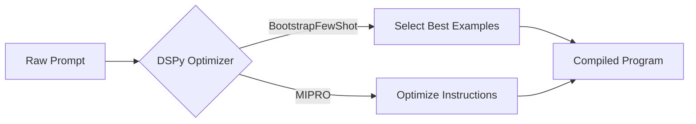

This project plan is designed to transition the repository from a **static text archive** to a **maintainable, executable software product**.

Given the nature of DSPy (which relies heavily on code execution and iteration), the primary architectural decision in this plan is to migrate to **Jupyter Book**. This allows your documentation to be tested like software.

### **Project Charter: "Executable DSPy"**

**Objective:** Refactor `Ebook_DSPy` into a self-validating, interactive learning platform hosted on GitHub Pages.
**Timeline:** 2 Weeks (Sprints).
**Key Result:** A repo where `git push` triggers a test run of all code examples and auto-deploys a refreshed website.

---

### **Phase 1: Cleanup & Standardization (Day 1-2)**

*Goal: Eliminate ambiguity in the repository structure.*

The current dual-folder structure (`ebook/` vs `chapters/`) creates technical debt. We will consolidate this into a single "source of truth."

* [ ] **Task 1.1: Consolidate Content**
* Create a directory named `content/`.
* Move all markdown chapters from `ebook/` and `chapters/` into `content/`.
* Renumber them strictly (e.g., `01_fundamentals.md`, `02_signatures.md`) to define the sort order.


* [ ] **Task 1.2: Archive Administrative Files**
* Create a directory named `planning/`.
* Move `editorial-review-*.md`, `uiux.md`, and any non-content files here.
* *Decision:* These should eventually become **GitHub Issues** or **Projects** items rather than loose files.


* [ ] **Task 1.3: Python Standard Layout**
* Create a `src/` directory for shared utilities (e.g., custom metrics or datasets used across multiple chapters).
* Create a `tests/` directory (empty for now).


---

### **Phase 2: Infrastructure & Tooling (Day 3-5)**

*Goal: Implement the build engine using Jupyter Book.*

This replaces your manual HTML maintenance with an automated engine designed for data science.

* [ ] **Task 2.1: Install Jupyter Book**
* Add `jupyter-book` to your `requirements.txt`.
* Run `jupyter-book create .` to generate the `_config.yml` and `_toc.yml` structure.


* [ ] **Task 2.2: Configure Table of Contents (`_toc.yml`)**
* Map your new `content/` files in the TOC file.


* [ ] **Task 2.3: Configure Build (`_config.yml`)**
* Set the title, author, and—crucially—enable the "Launch Button" (Google Colab integration).


```yaml
# Example snippet for _config.yml
launch_buttons:
  colab_url: "https://colab.research.google.com"
execute:
  execute_notebooks: "off" # Start "off" then move to "auto" once code is fixed

```


* [ ] **Task 2.4: Setup GitHub Actions (CI/CD)**
* Create `.github/workflows/deploy.yml`.
* Use the `actions/deploy-pages` workflow to auto-build the HTML whenever you push to `main`.


---

### **Phase 3: Refactoring to "Literate Code" (Day 6-10)**

*Goal: Convert static Markdown into executable Notebooks.*

This is the heavy lifting. You are moving from "describing code" to "providing code."

* [ ] **Task 3.1: Conversion**
* Convert `Chapter 01` through `Chapter 03` from `.md` to `.ipynb`.
* *Tip:* Use `jupytext` to automate converting Markdown to Notebooks if strictly needed, but manual porting ensures you catch code errors.


* [ ] **Task 3.2: Dependency Pinning**
* Update `requirements.txt`. **Crucial:** Pin `dspy-ai` to a specific version (e.g., `dspy-ai==2.4.X`).
* Verify every import in the new notebooks works with this version.


* [ ] **Task 3.3: Output Caching**
* Run the notebooks locally to generate the cell outputs (graphs, optimization logs).
* Save the notebooks *with* outputs so readers can see the results without running the code themselves.


---

### **Phase 4: Expansion & Quality (Day 11-14)**

*Goal: Fill the content gaps identified in the review.*

* [ ] **Task 4.1: Add "Local Development" Section**
* Create `content/setup/local_models.md`.
* Document `dspy.Ollama` and `dspy.HFClientVLLM`.


* [ ] **Task 4.2: Add "Data Generation" Section**
* Create a guide on using a teacher model to generate synthetic `Example` objects for training.


* [ ] **Task 4.3: Add Diagrams**
* Replace static images with Mermaid.js charts inside the markdown cells of your notebooks.


**Example Mermaid Diagram for your "Optimizers" chapter:**



---

### **Phase 5: Maintenance Protocol (Ongoing)**

*Goal: Prevent "Bit Rot".*

* [ ] **Task 5.1: The "Nightly Build"**
* Create a separate GitHub Action that runs `pytest` on your notebooks once a week.
* *Why:* DSPy changes fast. If a library update breaks your tutorial, this bot will email you.


* [ ] **Task 5.2: Community Guidelines**
* Update `CONTRIBUTING.md` to explain how to edit a notebook and clear output before making a Pull Request.


### **Visualizing the Target State**

Here is what your repo structure should look like after Phase 1 and 2:

```text
Ebook_DSPy/
├── .github/
│   └── workflows/
│       ├── deploy.yml      # Auto-publishes to GitHub Pages
│       └── test.yml        # Tests code validity
├── content/                # The actual book
│   ├── 01_fundamentals.ipynb
│   ├── 02_signatures.ipynb
│   └── images/
├── src/                    # Shared Python code
│   └── dspy_utils.py
├── _config.yml             # Jupyter Book config
├── _toc.yml                # Table of Contents
├── requirements.txt
└── README.md

```